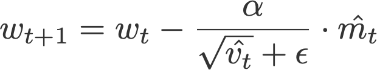
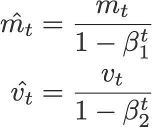
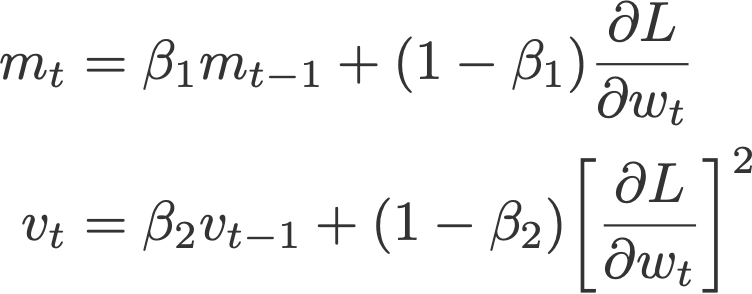
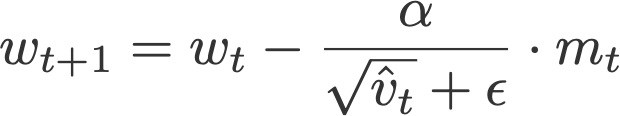
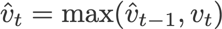
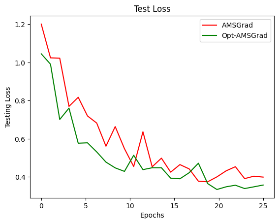
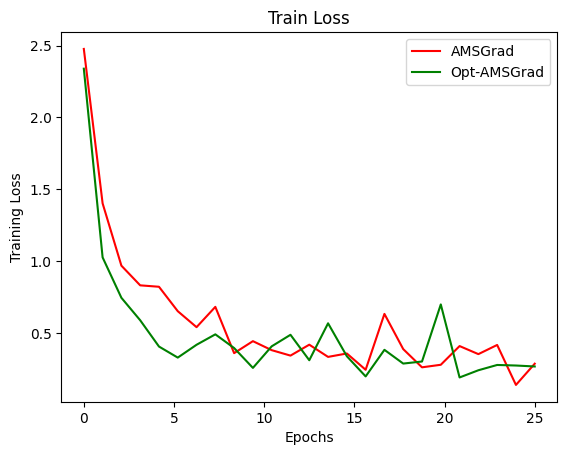
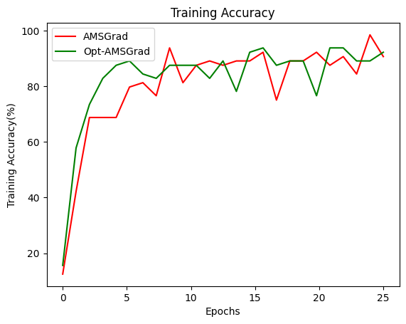
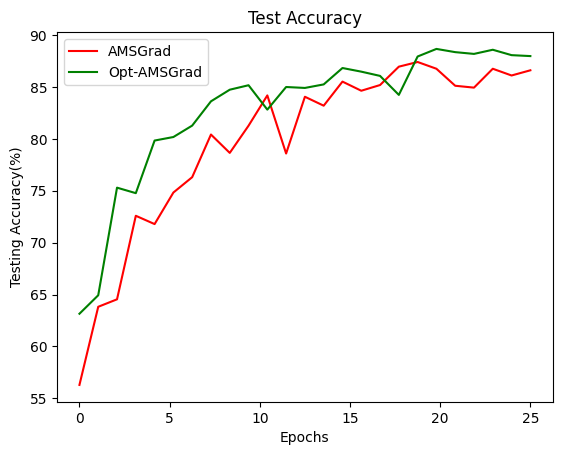

Implementing Optimistic Adaptive Acceleration For Optimization also
known as Optimistic-AMSGrad can be a challenge when working with large datasets such as CIFAR-100. To reduce the training time which would take a pretty long time and need additional computing resources. We are using CIFAR-10 datasets which as 10 different categories of images containing a fair amount of 600 images per category. 
As this is an extension for AMSGrad we have to compare the AMSGrad results with OPTIMISTIC-AMSGrad.
Optimization algorithms are vastly used in various models such as
Resnet18, Googlenet, Densenet, etc. In our implementation, we have used
the Resnet18 model with Optimistic-AMSGrad and AMSGrad optimization
algorithms which demonstrate that Optimistic-AMSGrad improves AMSGrad.

<u>1.INTRODUCTION</u>

Predicting gradients beforehand will greatly reduce the number of epochs
to be trained. Combining Optimistic Online Learning with adaptivity and
the momentum to create the OPTIMISTIC-AMSGrad is a good idea. The
implementation of the algorithm shows that OPTIMISTIC-AMSGRAD improves
AMSGRAD in terms of various measures: training loss, testing loss, and
classification accuracy on training/testing data over epochs. The basis
of this algorithm is optimistic online learning. The basic idea behind
online learning is to have a good guess over the loss function before
choosing action and then the learner should exploit the guess to choose
an action.

1.  <u>Relation Of ADAM with AMSGrad</u>

ADAM is a popular learning algorithm for training various neural
networks. Adaptive moment estimation, or Adam, is simply a combination
of momentum and RMSprop. It acts upon the gradient component by
using *m*, the exponential moving average of gradients (like in
momentum), and the learning rate component by dividing the learning
rate *α* by square root of *v*, the exponential moving average of
squared gradients (like in RMSprop).

where

are the bias corrections, and

with *m *and *v* initialised to 0.

Another variant of Adam is the AMSGrad, This variant revisits the
adaptive learning rate component in Adam and changes it to ensure that
the current *v *is always larger than the *v* from the previous time
step*.*

where

and

with *m *and *v* initialised to 0.

Default values:

-   *α* = 0.001

-   *β*₁ = 0.9

-   *β*₂ = 0.999

-   *ε* = 10⁻⁷

OPTIMISTIC-AMSGrad in each iteration the learner computes a gradient
vector it maintains moving average of theta which is followed by the max
operation. The first property helps for acceleration when the gradient
has a sparse structure. The second one is from the well-recognized idea
of momentum which can also help for acceleration. The last one, perhaps
less known outside the ONLINE LEARNING community, can actually lead to
acceleration when the prediction of the next gradient is good. This
property will be elaborated in the following subsection in which we
provide the theoretical analysis of OPTIMISTIC-AMSGRAD.

<u>2.IMPLEMENTATION</u>

**CIFAR-10**: The CIFAR-10 dataset consists of 60000 32x32 color images
in 10 classes, with 6000 images per class. There are 50000 training
images and 10000 test images. The dataset is divided into five training
batches and one test batch, each with 10000 images. The test batch
contains exactly 1000 randomly-selected images from each class. The
training batches contain the remaining images in random order, but some
training batches may contain more images from one class than another.
Between them, the training batches contain exactly 5000 images from each
class.

classes = ('plane', 'car', 'bird', 'cat', 'deer', 'dog', 'frog',
'horse', 'ship', 'truck') ** **

**ResNet18**: Deep residual learning framework for the image
classification task. Which supports several architectural
configurations, allowing to achieve a suitable ratio between the speed
of work and quality.

**Default Values:**

-   Epochs – 25

-   Beta1 – 0.9

-   Beta2 – 0.999

-   Learning rate – 0.001

-   Span – 5

-   Weight\_decay – 0

**Training Platform:**

Google Colab with GPU acceleration and pytorch as the underlying
framework.

**Files:**

-   optimistic\_amsgrad\_cifar10.py – This is the primary file that
    contains the resnet18 model, OPTIMISTIC-AMSGrad optimizer, Loads
    CIFAR-10 dataset.

-   amsgrad\_cifar10.py – This is our base implementation of AMSGrad to
    compare the results with our desired algorithm.

-   opt\_admgrads\_cifar10.mat – Contains the accuracy, loss of epochs
    for test and train datasets. It implements Optimistic-AMSGrad
    algorithm.

-   amsgrad\_cifar10.mat - Contains the accuracy, loss of epochs for
    test and train datasets. It implements AMSGrad algorithm.

-   plotdata.py – Plots the data of two algorithms using matplotlib.
    (Reshapes the data and overlaps the graphs)

<u>3.RESULTS</u>

To understand the performance improvement we are choosing the base
algorithm as AMSGrad and overlapping the two graphs which are trained
under the similar environment with approximately similar default values.

<u>OBSERVATION</u>

As it is an iteration of ADAM we cannot expect a large performance boost
in accuracy and training time but significant improvement is observed
with CIFAR-10 dataset. To be specific during the first few epochs, the
algorithm has a better gradient prediction than that of AMSGrad. We have
only trained 25 epochs because each epoch is talking approximately 40
mins to train in google colab. I doubt, even if we increase the number
of epochs to 100 the difference will be the same. It is always ideal to
use the best optimization algorithm available out there even if the
performance difference is little.

<u>REFERENCES</u>

1.  On the Convergence Proof of AMSGrad and a New Version - Tran Thi
    Phuong, Le Trieu Phong.

2.  Optimistic Adaptive Acceleration for Optimization - [Jun-Kun
    Wang](https://arxiv.org/search/stat?searchtype=author&query=Wang%2C+J), [Xiaoyun
    Li](https://arxiv.org/search/stat?searchtype=author&query=Li%2C+X), [Ping
    Li](https://arxiv.org/search/stat?searchtype=author&query=Li%2C+P)

3.  Adam: A Method for Stochastic Optimization - [Diederik P.
    Kingma](https://arxiv.org/search/cs?searchtype=author&query=Kingma%2C+D+P), [Jimmy
    Ba](https://arxiv.org/search/cs?searchtype=author&query=Ba%2C+J)

4.  Pytorch-docs: https://pytorch.org/docs/stable/index.html
