### In collaboration with [Matteo Ginesi](https://it.linkedin.com/in/matteo-ginesi), [Github](https://github.com/matginesi)

The recent security needs due to the Covid − 19 pandemic have led to the creation of facial recognition systems that must extend further with respect to the normal capabilities of classic CNN solutions. Facial recognition networks usually exploit the presence of hidden features within the images, which are extracted from the convolutional layers and categorized with “fully connected layers” that return fundamental facial parameters or, in less complex applications, the presence or absence of a face in the image. 

This work consists in the creation of a robust convolutional network that is able to discriminate covered or not covered faces in a more robust way to overcome mask presence in photos. This led us to the study and development of a network (in the convolutional part) that could primarily recognize a face from any photo. The rigidity to errors of this “step” allowed us to develop and refine all the other aspects for the discrimination.

## Dataset creation

The main initial difficulty we encountered was building a dataset that
was right for our purpose. There are many datasets on the web for
training networks for face recognition but none of them had the right
requirements we needed. This prompted us to create our own dataset built
by unifying others with the following characteristics:

-   3828 images of uncovered faces  
    (extracted from Flickr-Faces-HQ Dataset[3])

-   3725 images of mask-covered faces(custom dataset scraped from google
    based on keywords which are royalty free and comes under fair use)

-   3710 random images (scraped from google are also royalty free and
    comes under fair use)

### Dataset sub-set

#### Random images

It is a sub-dataset build upon a different variety of images in order to
build “stiffness” to the simple task of binary classification between
*face* and *no face*. The dataset have been augmented in terms of image
sizes, rotations, translations, color palettes and proportions. Other
than faces this set of photos is made of animals, computer parts,
insects, furniture, real and drawn fruits and vegetables, flowers,
landscapes, buildings, money, cups, airplanes, plants and trees, musical
instruments, fossils, tools, boats and guns (all unrelated subjects to
faces).

#### Uncovered faces

This sub-dataset is a composite of different faces from distinct regions
which makes it possible to use it in most of the countries without false
positives and it isn’t augmented: developemnt results shown us problems
of overfitting even after small number of epochs and no other benefits
at all. The only augmentation present is on a small proportion of it and
involves only mirroring and small rotations in order to get balance
between the various categories in it. Faces are provided with and
without glasses, to accommodate the network’s results to a common item
and, therefor to increase overall accuracy.

#### Mask-covered faces

No overall augmentation. Because this dataset is a synthetic dataset
which is generated by a GAN and even though the overall dataset has same
color and same shaped masks. Our model is able to generalize the images
much more accurately than we thought.

## Dataset classes

We have implemented networking in python via the pytorch framework. The
first thing we have done is the creation of dataset class in order to
load and prepare data. From our set of image a loader is made of:

-   Resized images of 32 × 32 pixels

-   Normalized RGB values in the range of 0 ÷ 1 32-bit floating point

-   Tensor data

-   No run-time augmentation

Augmentation can be tricky in terms of accuracy and overfitting: we
decided to use augmentation only for the mask-covered and uncovered
faces. For what concern other data management, the dataset is divide in
a *k-folded* stratified agglomeration both for *test* and *validation*,
with a batch size of 32.

## CNN model for face mask detection

The convolutional network model that we have created can be schematized
as follows; for the input we have a three channels image 32 × 32 (R,G,B
colours), for the output we have integer classification classes (0÷2):

0: No mask detection

1: Mask detected

2: No mask recognition (not present nor human being subject)

The CNN is composed by four layers (Table
<a href="#tab:layers of CNN" data-reference-type="ref" data-reference="tab:layers of CNN">1.1</a>):
two convolutional and two linear fully-connected, the overall trainable
parameters are 18123.

<table>
<caption>FC stand for <em>Fully Connected</em>. The value  − 1 in the output shape stands for “no value required".</caption>
<thead>
<tr class="header">
<th style="text-align: center;">Layer</th>
<th style="text-align: left;">Layer type</th>
<th style="text-align: left;">Output shape</th>
<th style="text-align: left;">Parameters</th>
</tr>
</thead>
<tbody>
<tr class="odd">
<td style="text-align: center;">0</td>
<td style="text-align: left;">Conv2D</td>
<td style="text-align: left;">[−1,16,32,32]</td>
<td style="text-align: left;">448</td>
</tr>
<tr class="even">
<td style="text-align: center;">1</td>
<td style="text-align: left;">Conv2D</td>
<td style="text-align: left;">[−1,8,16,16]</td>
<td style="text-align: left;">1160</td>
</tr>
<tr class="odd">
<td style="text-align: center;">2</td>
<td style="text-align: left;">Linear (FC)</td>
<td style="text-align: left;">[−1,32]</td>
<td style="text-align: left;">16416</td>
</tr>
<tr class="even">
<td style="text-align: center;">3</td>
<td style="text-align: left;">Linear (FC)</td>
<td style="text-align: left;">[−1,3]</td>
<td style="text-align: left;">99</td>
</tr>
</tbody>
</table>

FC stand for *Fully Connected*. The value  − 1 in the output shape
stands for “no value required".

## Training phase

The training phase is composed as follows: for each batch get the images
and its labels and then get prediction by the model (CNN). Do the
comparison between *actual* and *predicted* values.

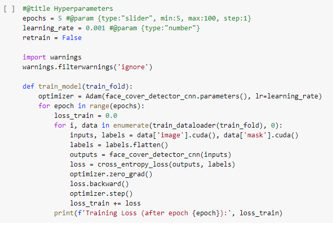

After several development tests, in order to avoid overfitting or any
accuracy losses, the best training method results to be with 40 training
epochs, *Cross entropy* loss function between *outputs* and *labels*,
*Adam optimizer* for optimization and learning rate of 0.001.

## Results

### Evaluation tests

Here are some random evaluation examples. Remember that classes are 0
for no mask, 1 face covered by a mask, 2 no mask recognition (not
present nor human being subject).

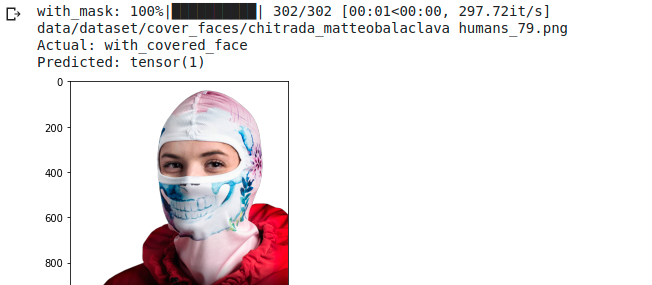  
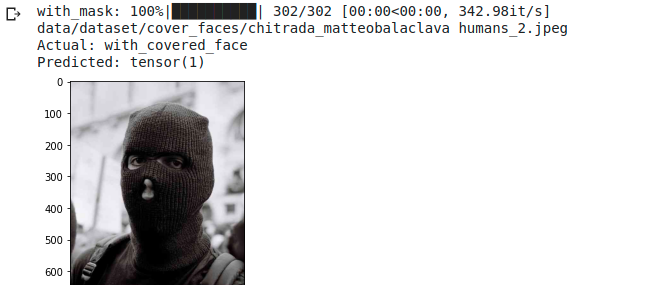
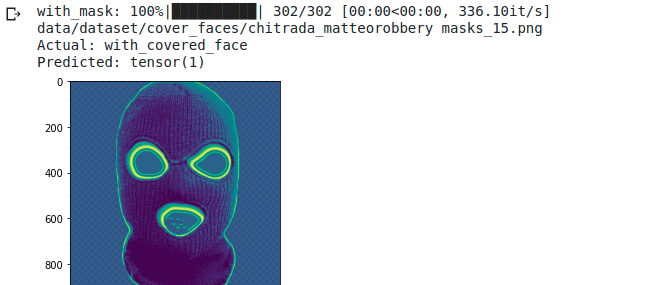

The examples shown in (Fig.
<a href="#fig: balaclava examples" data-reference-type="ref" data-reference="fig: balaclava examples">[fig: balaclava examples]</a>)
are “true” that is, no miss-classification errors were made. We can see
how the network is able to manage images with more people (see (Fig.
<a href="#fig: balaclava examples" data-reference-type="ref" data-reference="fig: balaclava examples">[fig: balaclava examples]</a>-1)
and with distorted or unnatural colors (Fig.
<a href="#fig: balaclava examples" data-reference-type="ref" data-reference="fig: balaclava examples">[fig: balaclava examples]</a>-3
and 4). Finally we can guess on which hidden variables the network is
able to extract the various features in the last photo.

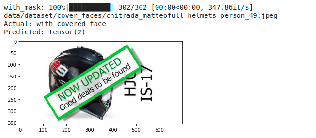
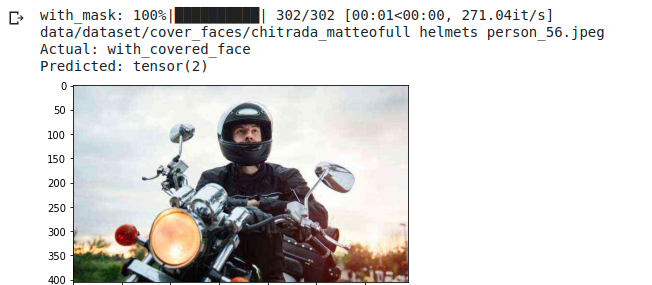  
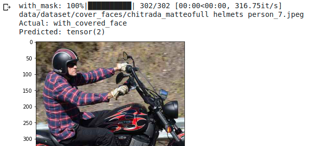
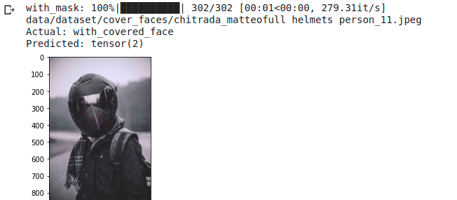

In the this sample batch (Fig.
<a href="#fig: helmet examples" data-reference-type="ref" data-reference="fig: helmet examples">[fig: helmet examples]</a>)
we can see how for extremely rotated or completely covered faces, the
network classifies as “no mask detected”.

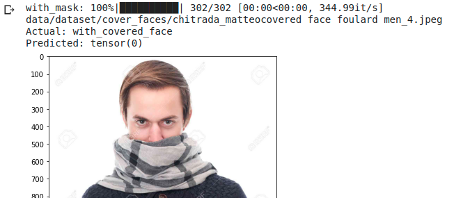
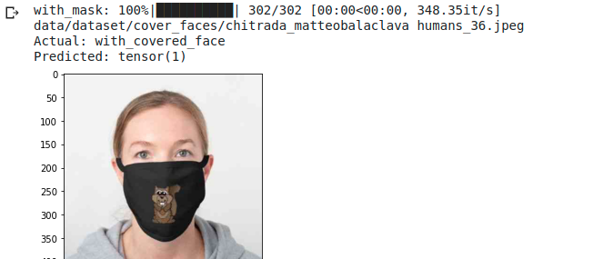  
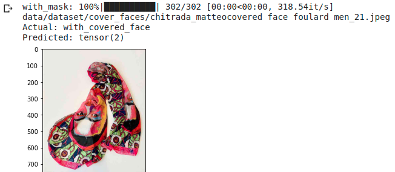
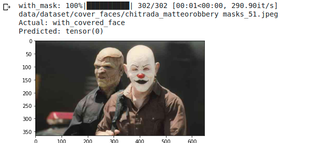

The first image (Fig.
<a href="#fig: others example" data-reference-type="ref" data-reference="fig: others example">[fig: others example]</a>)
is an example of miss-classification: the photo is an obvious person
covered by a scarf but the network interprets it as “no mask detect”.
This lead us to increase the number of epochs, the size of the dataset
and (even if development times can be much longer) the complete redesign
of the layers of the convolutional network. The second image as shown in
(Fig.
<a href="#fig: others example" data-reference-type="ref" data-reference="fig: others example">[fig: others example]</a>)
is perfectly classified: the presence or absence of the nose is assumed
to affect the hidden variables and therefore also the features that are
extracted. In the third image the classification is perfect, but as
previously mentioned we have worked on the quality of the discriminator
on the “not facing” images to reduce the presence of errors in the
following stages. The last one instead shows the robustness of the
entire network even in the presence of several faces at the same time.

### Performances

Most of the images are properly classified, as we can see from the
confusion matrix (Fig.
<a href="#fig: confusion_matrix" data-reference-type="ref" data-reference="fig: confusion_matrix">[fig: confusion_matrix]</a>),
while only a very small fraction is miss-classified (less than 10%). The
metrics show us the quality of the desciminator in more detail. We can
see how the main values are all above 90%.

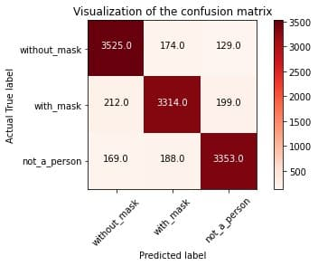
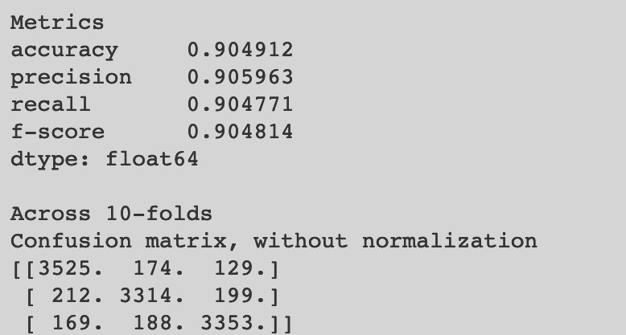 \[fig: confusion\_matrix\]

### Accuracy

In development stage we saw that already at the first epochs of
k-folding the accuracy does not go overfitting. All the optimization
work done both on the network and on the dataset have led to avoiding
overfitting even throughout the training course. This is a sample plot
of the first epochs: even in a small number is evident how overfitting
doesn’t affect the first “runs” of the evaluation.

<figure>
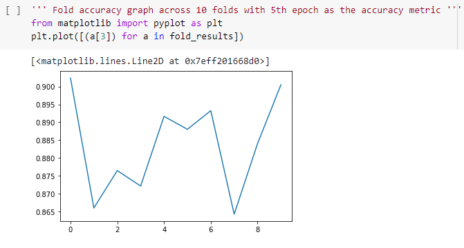<figcaption aria-hidden="true">Accuracy.</figcaption>
</figure>

# New implementation and development

The first thing we thought about changing was the accuracy. To do this
we analyzed the data realizing how they were easily influenced by the
type of training (speaking of the division of the dataset into
“training” and “validation” sets). In addition, the evaluation made
using the “k-fold” method is energy-intensive and very long-lasting, but
giving unsatisfactory results: a useless effort. As for the geometry of
the CNN network used (layers, depth, activation function,
fully-connected layer) the size of the input images is limited to files
32 × 32 *p**x*: even reaching an accuracy of 86%, analyzing the trend of
the loss function and of the error in training, we realized that we were
on the verge of overfitting even with very low learning rate values (in
the order of 0.0005). We therefore decided to change the order.  
Firstly, CNN Net is called in the python code `FaceMaskDetectorCNN()`,
it is still valid for comparison purposes, even with images dimension
limit of 32 × 32 *p**x*. The new network is a modified pre-trained
*ResNet50* and then the training method in order to get track of epoch’s
metrics (accuracy in primis) this phase is composed, for each epoch, of
a training phase and a small evaluation (at 10 batch samples).

## Implemented network 

A pre-trained **ResNet50** model is used, with the last *fully connected
layer* modified to fit our specification on output classes and be
trained with our dataset. The size specification table can be found at
Table
<a href="#Table: 2.1" data-reference-type="ref" data-reference="Table: 2.1">2.1</a>

1fil

<table>
<caption>Specification of the <em>ResNet50</em> pretrained model.</caption>
<tbody>
<tr class="odd">
<td style="text-align: left;">Total params</td>
<td style="text-align: right;">24, 562, 250</td>
<td style="text-align: left;">Forward/backward pass size</td>
<td style="text-align: right;">374.28 MB</td>
</tr>
<tr class="even">
<td style="text-align: left;">Trainable params</td>
<td style="text-align: right;">1, 054, 218</td>
<td style="text-align: left;">Params size</td>
<td style="text-align: right;">93.70 MB</td>
</tr>
<tr class="odd">
<td style="text-align: left;">Non-trainable params</td>
<td style="text-align: right;">23, 508, 032</td>
<td style="text-align: left;">Estimated Total Size</td>
<td style="text-align: right;">468.73 MB</td>
</tr>
<tr class="even">
<td style="text-align: left;">Input size</td>
<td style="text-align: right;">0.75 MB</td>
<td style="text-align: left;"></td>
<td style="text-align: right;">[Table: 2.1]</td>
</tr>
</tbody>
</table>

Specification of the *ResNet50* pretrained model.

An architecture scheme of the network is showed below (Fig.
<a href="#fig: ResNet50" data-reference-type="ref" data-reference="fig: ResNet50">[fig: ResNet50]</a>).

1fil 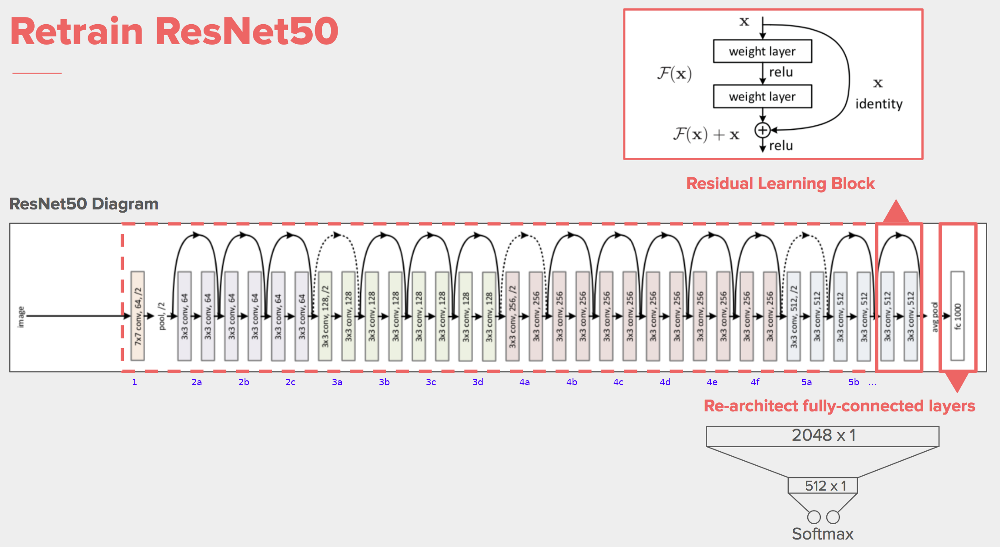

## Data management

To maintain continuity and backward compatibility with the old network
and its dataset, we have optimized the loading of data. By
parameterizing of input figure size to accommodate the input layer of
the *ResNet50* network. Data loading functions have been paralyzed both
in presence of single or multiple GPU computing units. The whole dataset
is divided into two major parts: training data (80% of total images) and
evaluation data (20% of total images). As far as the dataset is
concerned, nothing was done: we kept the same hard-built dataset with
all the specification already mentioned.

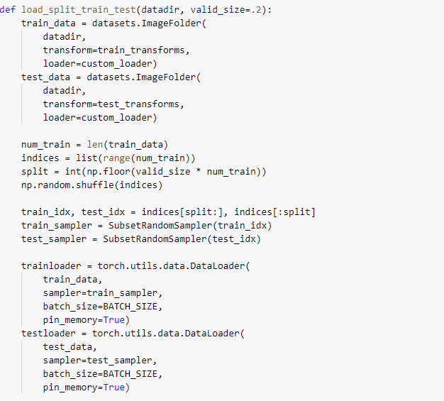

## Training phase

Network’s training phase has been completely rewritten simplifying it in
terms of timing, complexity, increasing the speed of execution both with
the network written by us and *ResNet50*, in which the only notable
difference is a performance improvement in terms of accuracy. The
workflow has been simplified: for each epoch, small batches of
predefined sizes are fed to the network (finely researched to keep the
speed/computational resources ratio balanced), after which the loss
function is calculated as:  
For *ResNet50*: negative log likelihood  
For our CNN: Cross entropy loss Optimization operations (through the
Adam algorithm, acting on the parameters of the network with a
pre-established constant learning rate). The value of the loss function
is saved in order to average it for each batch and be graphed.

### Evaluation phase

With bacth size of 256, within the same epoch, the network is evaluated,
thus being able to calculate, always on average, both the train loss and
the evaluation/test losses.

## Metrics

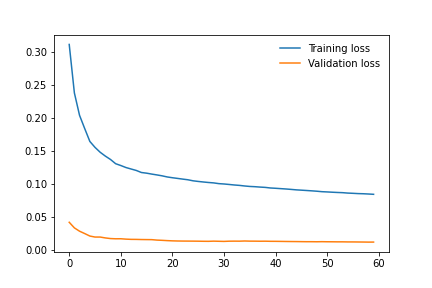
\[fig: 2.4\]

<figure>
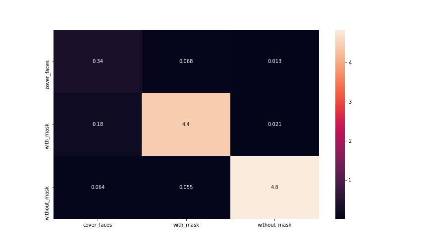<figcaption aria-hidden="true">Heatmap confusion matrix indicating the model performancs from the training phase.</figcaption>
</figure>

## Final results

    Total train + eval time: 01:21:51
    Batch size: 256
    Workers: 128
    Resize param: 256
    Epochs: 60
    Learning rate: 0.0005
    Model: ResNet50
    Metrics report:
                  precision    recall  f1-score   support

     cover_faces       0.58      0.81      0.67        98
       with_mask       0.97      0.96      0.96      1092
    without_mask       0.99      0.98      0.98      1166

        accuracy                           0.96      2356
       macro avg       0.85      0.91      0.87      2356
    weighted avg       0.97      0.96      0.96      2356

We can see how the learning rate is very low (0.005): this is because
the network tends to go immediately into overfitting. In order not to
intervene too much on the *ResNet50* or not to completely disrupt our
initial network, we have chosen to keep this value low, at the expense
of a longer training, but as can be seen from the data there has been a
significant decrease: from more than 8 hours to about 1 hour and 20
minutes.

## Old CNN on new training phase results

The comparison between the CNN network model written by us and
*ResNet50* led to these results. From (Fig.
<a href="#fig: 2.4" data-reference-type="ref" data-reference="fig: 2.4">[fig: 2.4]</a>)
we can observe the training and validation losses which shows us a good
training behavior with steady decreasing losses. Based on the heatmap
from (Fig.
<a href="#fig: 2.5" data-reference-type="ref" data-reference="fig: 2.5">2.1</a>)
we can see our model has a good generalization behavior, however our
network involves the achievement of excellent levels of accuracy, but
never reaches or exceeds the *ResNet50*. The results (with relative
timing) of the two training carried out are indicated below.

Our network, at the expense of lower accuracy (less than 86% or 92%),
training times are drastically shorter, but above all the size of the
models and the need for computational power are considerably lower than
the other. This would allow the implementation in portable, embedded or
edge-computing systems: this is not unimportant at the production and
distribution level.

### Training on 120 epochs

    Total train + eval time: 01:58:36
    Batch size: 128
    Workers: 128
    Resize param: 32
    Epochs: 120
    Learning rate: 0.001
    Model: FaceMaskDetectorCNN
    Metrics report:
                  precision    recall  f1-score   support

     cover_faces       0.61      0.27      0.38        92
       with_mask       0.89      0.94      0.92      1101
    without_mask       0.95      0.93      0.94      1163

        accuracy                           0.91      2356
       macro avg       0.82      0.72      0.74      2356
    weighted avg       0.91      0.91      0.91      2356    

### Training on 240 epochs

    Total train + eval time: 03:22:14
    Batch size: 128
    Workers: 128
    Resize param: 32
    Epochs: 240
    Learning rate: 0.001
    Model: FaceMaskDetectorCNN
    Metrics report:
                  precision    recall  f1-score   support

     cover_faces       0.76      0.33      0.46        87
       with_mask       0.88      0.96      0.92      1096
    without_mask       0.96      0.92      0.94      1173

        accuracy                           0.92      2356
       macro avg       0.87      0.74      0.77      2356
    weighted avg       0.91      0.92      0.91      2356

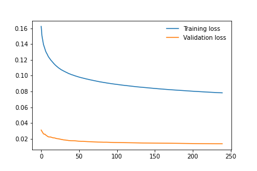  

# Conclusions

## Further improvements and developments

For each training, a file of the model trailed is created and saved as:

`<model_name>_rp##_e###_lr#####.pth`

-   `model_name`: either `ResNet50` and `FaceMaskDetectorCNN`

-   `rp`: image resize parameter (eg: 32 × 32 *p**x* images)

-   `e`: epochs

-   `lr`: fixed learning rate

so that the implementation for use as a classifier can be carried out in
the simplest and most flexible way possible. In fact, the model is
complete with all the necessary information, it does not need training
or various modifications and it can be loaded directly through the
pytorch `model.load(file_name)` functions both through the python
front-end and through the use of the pytorch library (`C++` front-end).

This allows implementation on both low-power embedded systems and larger
infrastructures in order to leave the user the choice between
edge-computing and cloud-computing. The classification times, thanks
also to the reduction of the input image, are around values below one
second. It should also be remembered that all the calculated performance
values are carried out during the training phase through the splitting
of the dataset and the consequent creation of a sub-set of evaluation
images, which is carried out every 10 (even if the value can be
modified) batch set. The evaluation phase has negligible times, less
than one minute in all tests carried out so far.

## Conclusions

The face mask detection task is achievable by the above designed
implementation, for accuracy values below 96%, based on our evaluation
on the network. This is due to the datasets distinct environments and
conditions are limited compared to the real life scenarios. To address
this problem, a larger real-life, with different geographic regions
image sources can be used to achieve more reliable and generalized
model, hence more accuracy and better overall scores.

As the model is not designed for life threatening situations it can be
used as a safe alternative to in-person verification of masks in public
during this global pandemic conditions. We can also say that as our
model surpasses the threshold of 90%, any public place can be equipped
with a low-energy and low-cost without cloud-computing (which is hard to
reach in rural and remote areas). In the end, the proposed model and
experiments which have been performed in this paper are done with
performance limitation in mind so that it would be feasible to deploy in
a less expensive system.

[3] *Flickr-Faces-HQ Dataset (FFHQ)*,
<https://github.com/NVlabs/ffhq-dataset>, Nvidia.
