In this ever-changing world, everything is tending towards automation day by day and in this situation sensors, actuators and robot interaction with human plays an important role. In this particular project, we have designed a robot car that has light sensors to detect the light and follow it with the assistance of actuators(Motors). 

And finally the important part we have also incorporated the feature which strengthens the described automation feature i.e., Deep learning feature to analyze and understand a person’s *feelings* by looking at the face of the person and act according to the detected feeling of the person, The act specified here includes both motion of the car and the *speech* output from the car according to the mood of the person detected by using a camera. The design and working of this model are explained in detail in further sections.
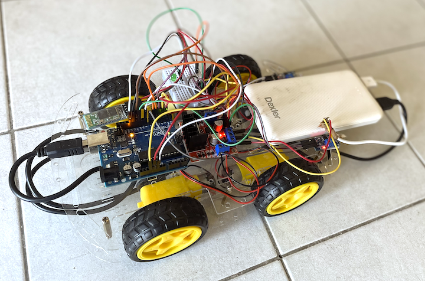


# INTRODUCTION

In this particular project, we have 4 wheel Drive robot car i.e., it
has 4 active motors, 2 optical sensors to detect the presence of
light, an L298N motor with the help of which the motors are driven and
an Arduino to pass the commands by reading the input. In particular,
our car has a virtual switch that can switch the modes of interaction
i.e., between light sensing robot and human interaction robot.

Let’s discuss the first mode which is a *light-sensing* robot, as we
have said above the car has two optical sides at the front part of the
chassis on either side. These optical sensors detect the light by
photo resistive principle and then sends a command to the Arduino and
then the Arduino works on the code which is mentioned for the light
detected accordingly. In this particular mode, we have 3 different
actions performed by the car. They are, moving forward wherein all the
four motors move in the same polarity at a maximum speed such that the
car moves forward. Left turn where in the right wheels have the
polarity to move forward and the left wheels have the opposite
*polarity* so that the car rotates around its center in the left
direction and the third action performed will be to turn right where
the car rotates towards right around the same center as of the left
turn and the polarity of the motors are quite opposite to the ones of
the left turn action and all these actions are performed according to
the position of the light whether it is straight or towards left or
towards the right.

Now about the second mode which is Human interaction, in this mode,
the Arduino board on the robot car is connected to via a Bluetooth
module which receives information from our User Interface designed in
PC this user interface detects the face of a person who accesses it
and analyze it as trained using ***CNN*** algorithm. This interface
analyses the emotion of the person and sends the corresponding
information to the Arduino and the Arduino then processes the
information and gives commands to the driver to perform particular
motions and along with the motion a voice message is also delivered
which is programmed according to the emotion detected.

<span id="_Toc79259213" class="anchor"></span>***Applications***:

-   Light following mode is used to decide a path for an autonomous
    robot in a laboratory i.e., to place the *photoresistor* downward
    and let the light be turned on till the robot needs to be running
    and the path should be reflecting the light incident on the path.

-   The same light following mode can be used for the vehicles in
    warehouses to make the vehicles autonomous and also they don’t come
    in the path of humans who are present in the same warehouses for
    some other works.

-   The second mode Human Interaction robot can be used in many ways one
    among them is to create a robot to interact with patients who have
    ***psychological*** issues and make them feel that they are not
    alone. These robots also help the patients with *autism* sort of
    issues to let their emotions speak without using their input and the
    same can be applied to other fields.

-   The ***emotion-sensing*** capability helps in monitoring serious
    patient conditions all the time and lets them maintain their balance
    with the commands set with the help of doctors for particular
    emotions and information passed to doctors if there is something
    really serious.

# COMPONENTS REQUIRED

1.  ***Arduino Uno Board***

The Arduino Uno is a microcontroller board based on the ATmega328. It
has 20 digital input/output pins (of which 6 can be used as PWM
outputs and 6 can be used as analog inputs), a 16 MHz resonator, a USB
connection, a power jack, an in-circuit system programming (ICSP)
header, and a reset button.

1.  ***Car chassis and DC Motors***

To realize the motions and to accommodate all the circuit boards on
the body we need to have particular dimensioned and flat chassis
(Recommended). The one which we used for this particular project is
shown below.

1.  ***L298N Driver***

The *L298N* is an integrated monolithic circuit in a 15-lead
Multi-watt and PowerSO20 packages. It is a high voltage, high current
dual full-bridge driver designed to accept standard TTL logic levels
and drive inductive loads such as relays, solenoids, DC and stepping
motors. Two enable inputs are provided to enable or disable the device
independently of the input signals. The emitters of the lower
transistors of each bridge are connected together and the
corresponding external terminal can be used for the connection of an
external sensing resistor. An additional supply input is provided so
that the logic works at a lower voltage.

1.  ***Optical Sensor***

An optical sensor converts light rays into electronic signals. It
measures the physical quantity of light and then translates it into a
form that is readable by an instrument. An optical sensor is generally
part of a larger system that integrates a source of light, a measuring
device and the optical sensor. 

1.  ***Bread Board***

Breadboard is a way of constructing electronics without having to use
a soldering iron. Components are pushed into the sockets on
the breadboard and then extra 'jumper' wires are used to make
connections.

1.  ***Bluetooth BT HC-06 module***

The HC-06 is a class 2 slave Bluetooth module designed for transparent
wireless serial communication. Once it is paired to a master Bluetooth
device such as PC, smart phones and tablet, its operation becomes
transparent to the user. All data received through the serial input is
immediately transmitted over the air.

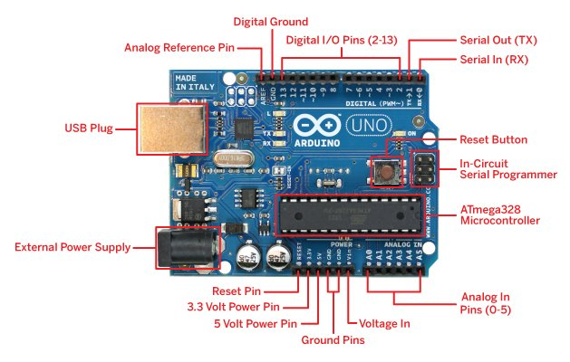

Fig. a) Arduino Uno Rev.3

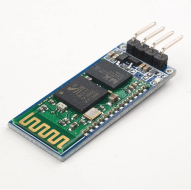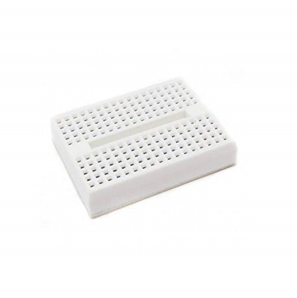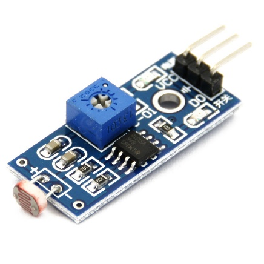

Fig. f) BT HC-06 Fig. e) Bread Board Fig. d) Optical Sensor

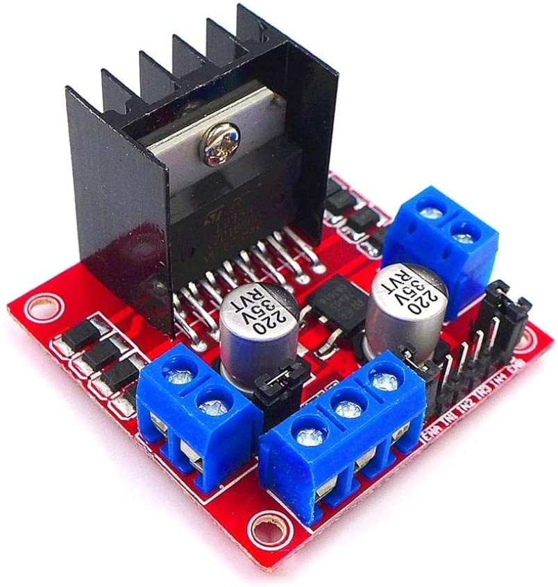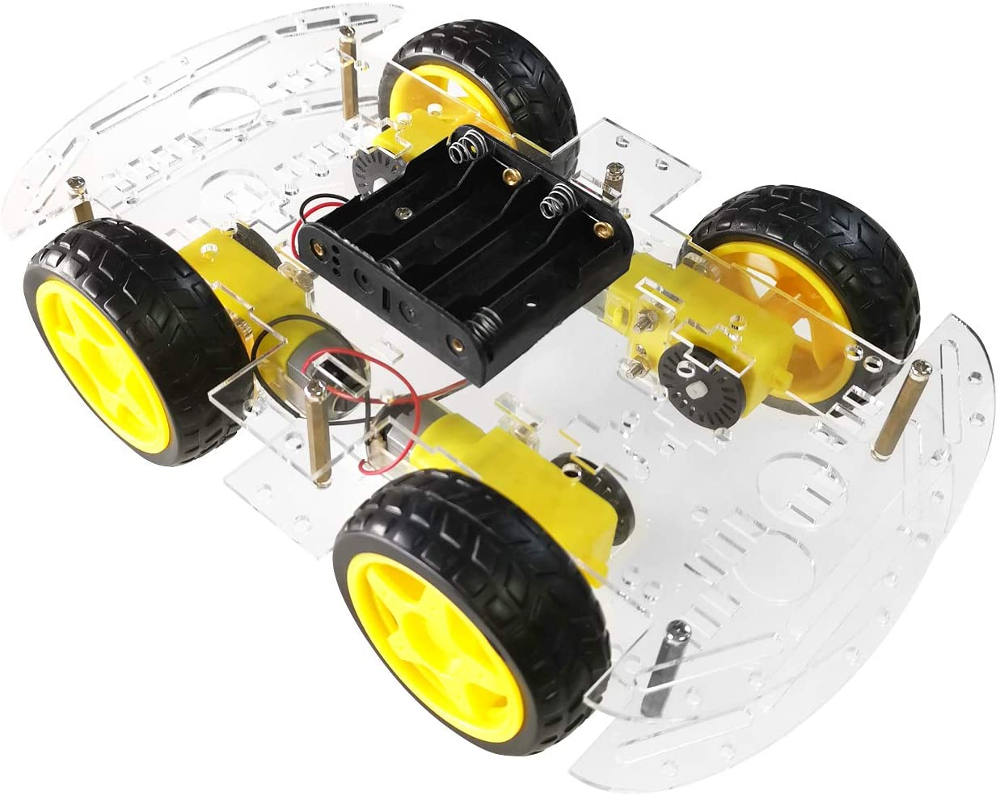

Fig. c) L298N Driver Fig. b) Car chasis and DC Motors

1.  ***Power Source***

A power source or a battery is used to deliver the required power to
the system built in this particular in order to have a rechargeable
capability and to produce enough energy we have used a portable power
bank in this particular project.

1.  ***A resistor and an LED***

A resistor of 220 ohms is used to protect the LED which is provided
indicate the mode in which the robot car is in i.e., whether it is in
light following mode or Human interaction mode.

# DESIGN AND RELATED WORK

Based on the paper “*Using a Social Robot to evaluate facial
expressions in the wild”* I have designed the system to implement the
experiment in real world.

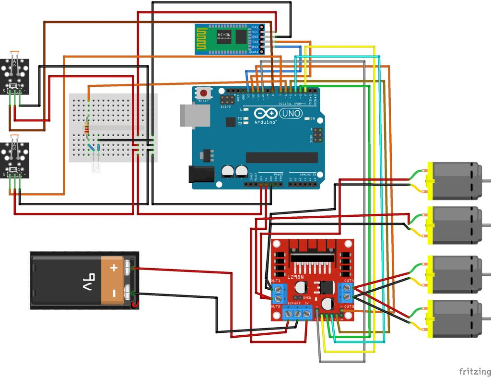

Fig.1 Circuit Diagram

As shown in figure.1 the digital pins 10 and 11 of the Arduino are
dedicated as enable pins for the driver module. The digital pins
2,3,4,5 are all connected to the input pins of the Driver. And the
digital pins 7 and 8 are set as receiver pins that receive data from
optical sensors.

Digital pin 12 acts as a data receiver pin that receives the
transferred data from the Bluetooth module and digital pin 13 acts as
a transmitter pin that transmits data to the Bluetooth module. The
negative ports of the left motors of the car are connected to out port
1 of the driver and the positives of the same motors to out port 2.
The negatives of the right side motors are connected to out port 3 of
the driver and the positives of the same motors to the out port 4.

The driver is connected to both the battery for 12V(input) and Arduino
for 5V(input) for power. The 3.3V output from Arduino is connected to
both the sensors and as the input voltage source for the Bluetooth
module. The digital pin 6 of the Arduino is used to light up the LED
used to indicate the mode of the Robot car (a resistor of 220V is
provided for protection). All the grounds are connected as per the
requirements from Arduino GND and Battery negative is connected to the
driver GND port.

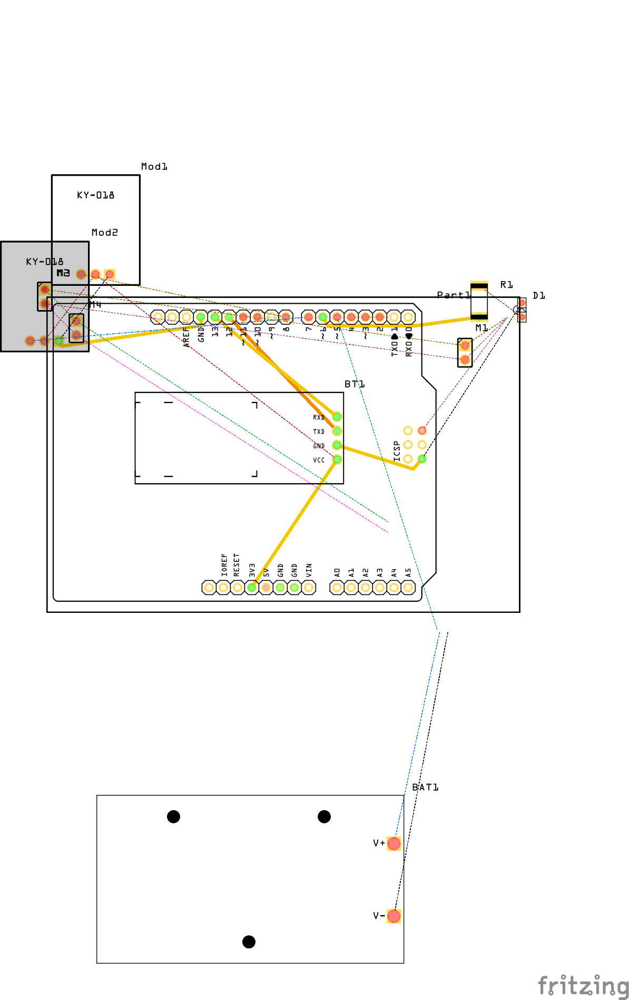

Fig.2 PCB design for the whole four wheeled robot

The above PCB design does not affect the project but instead optimises
the whole circuit to occupy a minimal space.

# IMPLEMENTATION

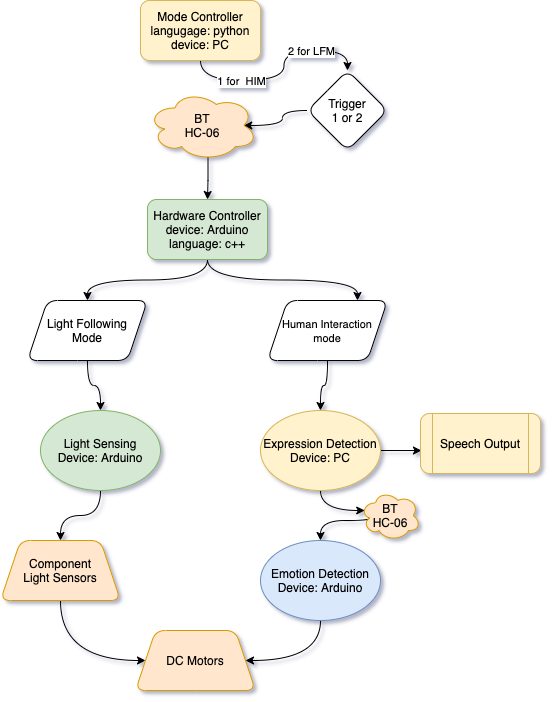

Fig.3 Flow Diagram of the whole implementation

*HIM: Human Interaction Mode, LFM: Light Following Mode*

***Mode Controller:*** This logic takes place on the parent device such
as PC. The main purpose of this block is to interactively change between
the two available modes such as

1.  Light Following Mode (LFM).

2.  Human Interaction Mode (HIM)

***Communication bridge:*** The communication with Arduino and PC is
done through Bluetooth protocol using BT HC-06 Bluetooth module. The
connection is established over a serial com port. The complete
implementation is done in python using the *Serial* library.

***Hardware Controller:*** This is the place where Arduino speaks for
itself when interacting with low-level hardware such as *photoresistors,
DC motors, Bluetooth serial communicator.* Moreover, it controls the
robot by performing pre-programmed actions when in ***HIM*** and
seamlessly changes to ***LFM*** when the parent device needs it.

***Light Following Mode:*** This mode allows the user to control the
movements of the robot with the help of a light source. Two optical
light sensors are used to achieve maximum efficiency and for the overall
control of the robot.

***Human Interaction Mode:*** Once the parent device successfully
identifies the facial expression and immediately sends the identified
emotion to the Arduino with the help of the PC’s internal Bluetooth
module. This triggers Arduino’s pre-defined function related to robot
pre-programmed actions.

***Speech Synthesis:*** When in ***HIM*** the parent device acts as a
one-way communication device between human and robot. Whenever a
successful emotion detection is performed the robot speaks when doing
the pre-defined actions to cheer the human.

## Light Following Mode

The Below flowchart explains the main process flow inside the Arduino.
This mode is performed independent of the parent device once
activated.

-   ***ldright*** and ***ldleft*** variables are triggered whenever one
    of the light sensors is activated.

-   If the two sensors are activated at the same time due to a light
    source been applied to both of them. Then the robot moves forward
    until the light source is turned off.

-   If only one sensor is activated then the robot moves towards the
    light source, based on which sensor gets activated if it is the left
    side sensor the robot turns the left side and it is the same for the
    other side.

-   If no sensor is triggered due to the absence of light then the robot
    comes to a halt stopping all 4 DC motors.

-   All the actions are wrapped in *trigger\_light\_sensors()* method
    and whenever the parent device sends “2” as a trigger value then
    this method is called.


Fig.4 Light following mode Arduino flowchart

## Human Interaction Mode

Using *Tensorflow* as backend framework and *Deep Convolutional Neural
Network (CNN)* we are able to achieve a validation accuracy of 61% and
test accuracy of 62%.

**Data:** The data consists of 48x48 pixel grayscale images of faces.
The faces have been automatically registered so that the face is more
or less centered and occupies about the same amount of space in each
image. The task is to categorize each face based on the emotion shown
in the facial expression into one of seven categories (0=Angry,
1=Disgust, 2=Fear, 3=Happy, 4=Sad, 5=Surprise, 6=Neutral).

train.csv contains two columns, "emotion" and "pixels". The "emotion"
column contains a numeric code ranging from 0 to 6, inclusive, for the
emotion that is present in the image. The "pixels" column contains a
string surrounded by quotes for each image. The contents of this
string a space-separated pixel values in row-major order. test.csv
contains only the "pixels" column and your task is to predict the
emotion column.

The training set consists of 28,709 examples. The public test set used
for the leader-board consists of 3,589 examples. The final test set,
which was used to determine the winner of the competition, consists of
another 3,589 examples.

## Model Architecture

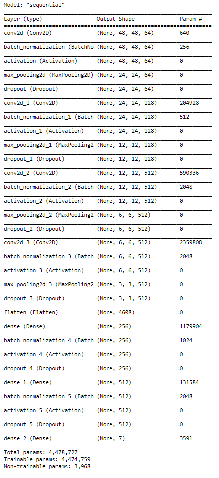

Fig.5 Deep CNN model – Trained on Tesla GPU (Google Colab)

## Arduino Emotion detection actions:

There are three different types of actions for three emotion
*happy(Fig.8), anger(Fig.7), sad(Fig.6)*.


Fig.6 Sad emotion robot action flowchart. Fig.7 Anger emotion robot
action flowchart.


Fig.8 Happy emotion robot action flow chart

# RESULTS

*Face Emotion Detection Model –* Trained to a maximum of 50 epochs and
their *accuracies, losses* are plotted using *matplotlib*.

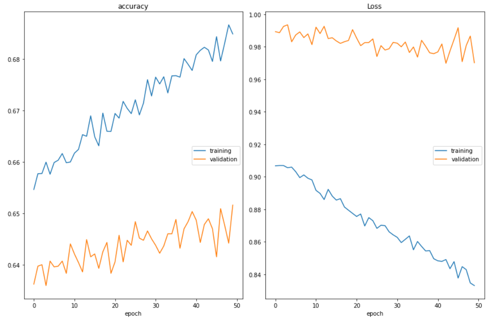

Fig.9 Accuracy and Loss Results of the Emotion detection model


The above emotions are detected in real-time by the built-in webcam of
the laptop and for each detection it sends the command to the Arduino
which performs the pre-programmed actions with speech synthesis.

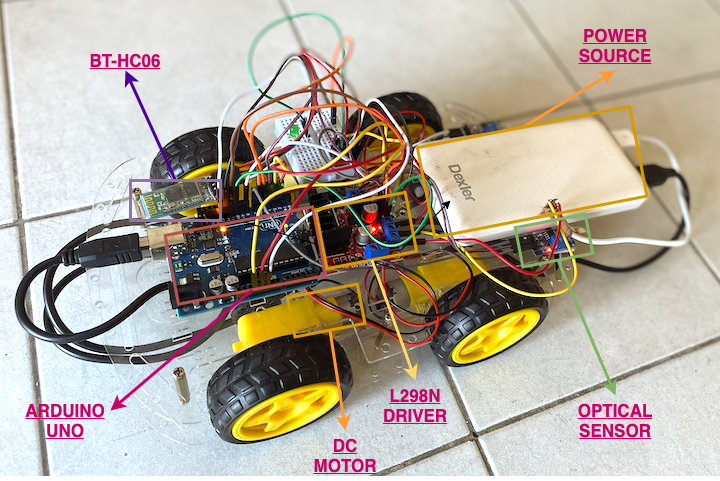

Fig.14 Four wheeled Robot with Light Sensing.

# CONCLUSIONS AND FUTURE SCOPE

From this project, we are able to design an autonomous car that can
follow a path in which the light is projected by using a simple
Arduino, Optical Sensors, and a driver. We have also designed an
interface to detect the facial expressions of a person and analyze the
emotion (out of 3 different emotions) to which the expression
corresponds and decide the emotion of a person, the entire analysis is
carried out in a PC and the command corresponding to the emotion are
sent to Arduino to perform some actions and give out some audio voice
which corresponds to the emotion analyzed.
>
As mentioned in the applications we can use this approach as a
prototype to automate the vehicles which have fixed paths and time to
travel by using light following the car model of this project. The
second mode is used in many ways it can be used anywhere where there
is an interaction required. It also has high scope in medical sciences
where we can analyze the emotion of a person and decide the stage of
the problem he/she has with proper training data set and medical
studies to resolve it or at least inform the situation to doctor if it
is necessary and so on.

# APPENDIX

## *Arduino Uno Pseudo Code:*
```
1.  #include &lt;SoftwareSerial.h>

2.  SoftwareSerial serial\_connection(12, 13);//Create a serial
    connection with TX and RX on these pins

3.  #define BUFFER\_SIZE 64//This will prevent buffer overruns.

4.  #define ledPin 6 // Pin 7 for the LED

5.   

6.  char inData\[BUFFER\_SIZE\];//This is a character buffer where the
    data sent by the python script will go.

7.  char inChar=-1;//Initialie the first character as nothing

8.  int count=0;//This is the number of lines sent in from the python
    script

9.  int i=0;

10. int RMotor\_1 = 2;

11. int RMotor\_2 = 3;

12. int LMotor\_1 = 4;

13. int LMotor\_2 = 5;

14. int REnable = 10;

15. int LEnable = 11;

16. int motor\_speed;

17. uint32\_t period = 11000L;

18. int loopcount;

19. void setup() {

20. Serial.begin(9600);

21. Serial.println("GPIO test!");

22. pinMode(ledPin,OUTPUT);

23. digitalWrite(ledPin,LOW);

24. serial\_connection.begin(9600);

25. serial\_connection.println("Reasdy");

26. Serial.println("Started");

27. pinMode(RMotor\_1, OUTPUT);

28. pinMode(RMotor\_2, OUTPUT);

29. pinMode(LMotor\_1, OUTPUT);

30. pinMode(LMotor\_2, OUTPUT);

31. pinMode(REnable, OUTPUT);

32. pinMode(LEnable, OUTPUT);

33.  

34. analogWrite(10, 210);

35. analogWrite(11, 210);

36. delay(1000);

37.  

38.  

39.  

40. }

41.  

42. void loop() {

43.  

44. byte byte\_count=serial\_connection.available();//This gets the
    number of bytes that were sent by the python script

45. if(byte\_count)//If there are any bytes then deal with them

46. {

47. Serial.println("Incoming Data");//Signal to the monitor that
    something is happening

48. int first\_bytes=byte\_count;//initialize the number of bytes that
    we might handle.

49. int remaining\_bytes=0;//Initialize the bytes that we may have to
    burn off to prevent a buffer overrun

50. if(first\_bytes>=BUFFER\_SIZE-1)//If the incoming byte count is more
    than our buffer...

51. {

52. remaining\_bytes=byte\_count-(BUFFER\_SIZE-1);//Reduce the bytes
    that we plan on handleing to below the buffer size

53. }

54. for(i=0;i&lt;first\_bytes;i++)//Handle the number of incoming bytes

55. {

56. inChar=serial\_connection.read();//Read one byte

57. inData\[i\]=inChar;//Put it into a character string(array)

58. }

59. inData\[i\]='\\0';//This ends the character array with a null
    character. This signals the end of a string

60. if(String(inData)=="2")//From Python script Turn LED ON when
    transmission starts

61. {

62. Serial.println("\*\*\*\*\*\*\*\*\* Control Handed Over to \[Light
    Sensors\] \*\*\*\*\*\*\*\*\*");

63. digitalWrite(ledPin, LOW); // Turn LED ON

64. trigger\_light\_sensors();

65.  

66. }

67. else if(String(inData)=="h")//Turn OFF LED when transmission Stops

68. {

69. Serial.println("\*\*\*\*\*\*\*\*\* Control \[CV\] has detected Happy
    \*\*\*\*\*\*\*\*\*");

70. digitalWrite(ledPin, HIGH); // Turn LED OFF

71. emotion\_happy();

72. }

73. else if(String(inData)=="a"){

74. Serial.println("\*\*\*\*\*\*\*\*\* Control \[CV\] has detected Anger
    \*\*\*\*\*\*\*\*\*");

75. digitalWrite(ledPin,HIGH);

76. emotion\_anger();

77. }

78. else if(String(inData)=="s"){

79. Serial.println("\*\*\*\*\*\*\*\*\* Control \[CV\] has detected SAD
    \*\*\*\*\*\*\*\*\*");

80. digitalWrite(ledPin,HIGH);

81. emotion\_sad();

82. 

83. 

84. }

85. for(i=0;i&lt;remaining\_bytes;i++)//This burns off any remaining
    bytes that the buffer can't handle.

86. {

87. inChar=serial\_connection.read();

88. }

89. Serial.println(inData);//Print to the monitor what was detected

90. serial\_connection.println("Bluetooth answers "+String(count)+":
    "+inData+" received");//Then send an incrmented string back to the
    python script

91. count++;//Increment the line counter

92. }

93. delay(100);

94.  

95. }

96. //Start CV Code Block

97. void emotion\_happy(){

98. 

99. uint32\_t end\_time=millis();

100. for( uint32\_t tStart = millis(); (end\_time-tStart) &lt;=
     period+period; ){

101. if (end\_time-tStart&lt;=period/2-2400){

102. turn\_left();

103. }else if (end\_time-tStart&lt;=9500-2400){

104. 

105. move\_forward();

106. }else if(end\_time-tStart&lt;=15000-4800){

107. turn\_right();

108. }else if(end\_time-tStart&lt;=19000-4800){

109. move\_forward();

110. }else{

111. move\_stop();

112. }

113. end\_time=millis();

114. }

115. digitalWrite(ledPin, LOW);

116. move\_stop();

117. }

118.  

119. void emotion\_sad(){

120. // 5 minutes

121. uint32\_t end\_time=millis();

122. for( uint32\_t tStart = millis(); (end\_time-tStart) &lt;=
     period+800; ){

123. if ((end\_time-tStart)&lt;=period/2){

124. turn\_left();

125. }else{

126. 

127. turn\_right();

128. }

129. end\_time=millis();

130. }

131. digitalWrite(ledPin, LOW);

132. move\_stop();

133. 

134. }

135.  

136. void emotion\_anger(){

137.  

138. uint32\_t end\_time=millis();

139. for( uint32\_t tStart = millis(); (end\_time-tStart) &lt; period;
     ){

140. if ((end\_time-tStart)&lt;=4000){

141. move\_backward();

142. //Serial.println("Back");

143. }else if(end\_time-tStart&lt;=7000){

144. 

145. move\_stop();

146. }else{

147. move\_forward();

148. //Serial.println("forward");

149.  

150. }

151. end\_time=millis();

152. }

153. digitalWrite(ledPin, LOW);

154. move\_stop();

155. 

156. }

157. //End CV Code Block

158. // Start Light Module Code Block

159. void trigger\_light\_sensors(){

160. int ldrright = digitalRead(7);

161. int ldrleft = digitalRead(8);

162. if (ldrright == 0 && ldrleft == 0) {

163. Serial.println("F");

164. move\_forward();

165. }

166. if (ldrright == 0 && ldrleft == 1) {

167. Serial.println("R");

168. turn\_right();

169. }

170. if (ldrright == 1 && ldrleft == 0) {

171. Serial.println("L");

172. turn\_left();

173. }

174. if (ldrright == 1 && ldrleft == 1) {

175. Serial.println("S");

176. move\_stop();

177. }

178. delay(100);

179. }

180.  

181. void move\_forward() {

182. digitalWrite(RMotor\_1, HIGH);

183. digitalWrite(RMotor\_2, LOW);

184. digitalWrite(LMotor\_1, LOW);

185. digitalWrite(LMotor\_2, HIGH);

186. }

187.  

188. void move\_backward() {

189. digitalWrite(RMotor\_1, LOW);

190. digitalWrite(RMotor\_2, HIGH);

191. digitalWrite(LMotor\_1, HIGH);

192. digitalWrite(LMotor\_2, LOW);

193. }

194.  

195. void turn\_right() {

196. digitalWrite(RMotor\_1, LOW);

197. digitalWrite(RMotor\_2, HIGH);

198. digitalWrite(LMotor\_1, LOW);

199. 

200. digitalWrite(LMotor\_2, HIGH);

201. Serial.println("R");

202.  

203. }

204.  

205. void turn\_left() {

206. digitalWrite(RMotor\_1, HIGH);

207. digitalWrite(RMotor\_2, LOW);

208. digitalWrite(LMotor\_1, HIGH);

209. digitalWrite(LMotor\_2, LOW);

210. Serial.println("L");

211.  

212. }

213.  

214. void move\_stop() {

215. digitalWrite(RMotor\_1, LOW);

216. digitalWrite(RMotor\_2, LOW);

217. digitalWrite(LMotor\_1, LOW);

218. digitalWrite(LMotor\_2, LOW);

219. }

220. // End Light Module Code Block

221.  
```
 

## *Python3 Face Expression Detection Pseudo Code:*
```

1.  import tensorflow as tf

2.  from tensorflow import keras

3.  import numpy as np

4.  import cv2

5.  from bluetooth\_com import cb\_bluetooth\_communicator

6.   

7.  emotion = \['Anger', 'Disgust', 'Fear', 'Happy', 'Sad', 'Surprise',
    'Neutral'\]

8.   

9.  model = keras.models.load\_model("model\_35\_91\_61.h5")

10. font = cv2.FONT\_HERSHEY\_SIMPLEX

11. cam = cv2.VideoCapture(0)

12. cam.set(3,1280)

13. cam.set(4,720)

14. face\_cas =
    cv2.CascadeClassifier('./cascades/haarcascade\_frontalface\_default.xml')

15.  

16. while True:

17. ret, frame = cam.read()

18. 

19. if ret==True:

20. gray = cv2.cvtColor(frame, cv2.COLOR\_BGR2GRAY)

21. #gray = cv2.flip(gray,1)

22. faces = face\_cas.detectMultiScale(gray, 1.3,5)

23. 

24. for (x, y, w, h) in faces:

25. face\_component = gray\[y:y+h, x:x+w\]

26. fc = cv2.resize(face\_component, (48, 48))

27. inp = np.reshape(fc,(1,48,48,1)).astype(np.float32)

28. inp = inp/255.

29. prediction = model.predict\_proba(inp)

30. em = emotion\[np.argmax(prediction)\]

31. 

32. print(em,type(em))

33. score = np.max(prediction)

34. cv2.putText(frame, em+" "+str(score\*100)+'%', (x, y), font, 1, (0,
    255, 0), 2)

35. cv2.rectangle(frame, (x, y), (x+w, y+h), (0, 0, 255), 2)

36. if em == 'Happy':

37. cb\_bluetooth\_communicator.cb\_ard\_com('h')

38. elif em == 'Sad':

39. cb\_bluetooth\_communicator.cb\_ard\_com('s')

40. elif em == 'Anger':

41. cb\_bluetooth\_communicator.cb\_ard\_com('a')

42. 

43. cv2.imshow("image", frame)

44. 

45. if cv2.waitKey(1) == 27:

46. break

47. else:

48. print ('Error')

49.  

50. cam.release()

51.  

52. cv2.destroyAllWindows()

53.  
```
 

## *Python3 Bluetooth Communicator Pseudo Code:*
```

1.  import time

2.  import bluetooth

3.  from serial import Serial

4.  from gtts import gTTS

5.  import time

6.  import pyttsx3

7.  engine = pyttsx3.init()

8.  engine.setProperty('rate', 180)

9.  serial\_com="/dev/cu.HC-06-DevB"

10. control\_cb\_command\_cv='1' # 1 for computer vision and 2 for light
    following

11. sad\_speak = 'Dont be sad, everything will be okay. One must not let
    oneself be overwhelmed by sadness.'

12. anger\_speak = 'Im sorry if i had done anything wrong. Holding on to
    anger is like grasping a hot coal with the intent of throwing it at
    someone else; you are the one who gets burned. '

13. happy\_speak='hurray, your smile makes me happy. Dont forget to
    smile everyday no matter what!'

14. language='en'

15. class cb\_bluetooth\_communicator:

16. def cb\_ard\_com(command):

17. # # Serial port parameters

18. serial\_speed = 9600

19. serial\_port = serial\_com # bluetooth shield hc-06

20. print("conecting to serial port ...")

21. try:

22. ser = Serial(serial\_port, serial\_speed, timeout=1)

23. print("sending message to turn on PIN 13 ...")

24. ser.write(str.encode(command))

25. except:

26. print('Cannot Connect to the Blutooth module..')

27. if command=='h':

28. pyttsx3.speak(happy\_speak)

29. elif command=='s':

30. pyttsx3.speak(sad\_speak)

31. elif command=='a':

32. print('hello')

33. pyttsx3.speak(anger\_speak)

34.  

35. print("recieving message from arduino ...")

36. data = ser.readline()

37.  

38. if (data != ""):

39. print("arduino says: %s" % data)

40. else:

41. print("arduino doesnt respond")

42.  

43. time.sleep(4)

44. print("finish program and close connection!")

45.  

46. #cb\_bluetooth\_communicator.cb\_ard\_com('a')

47.  

```